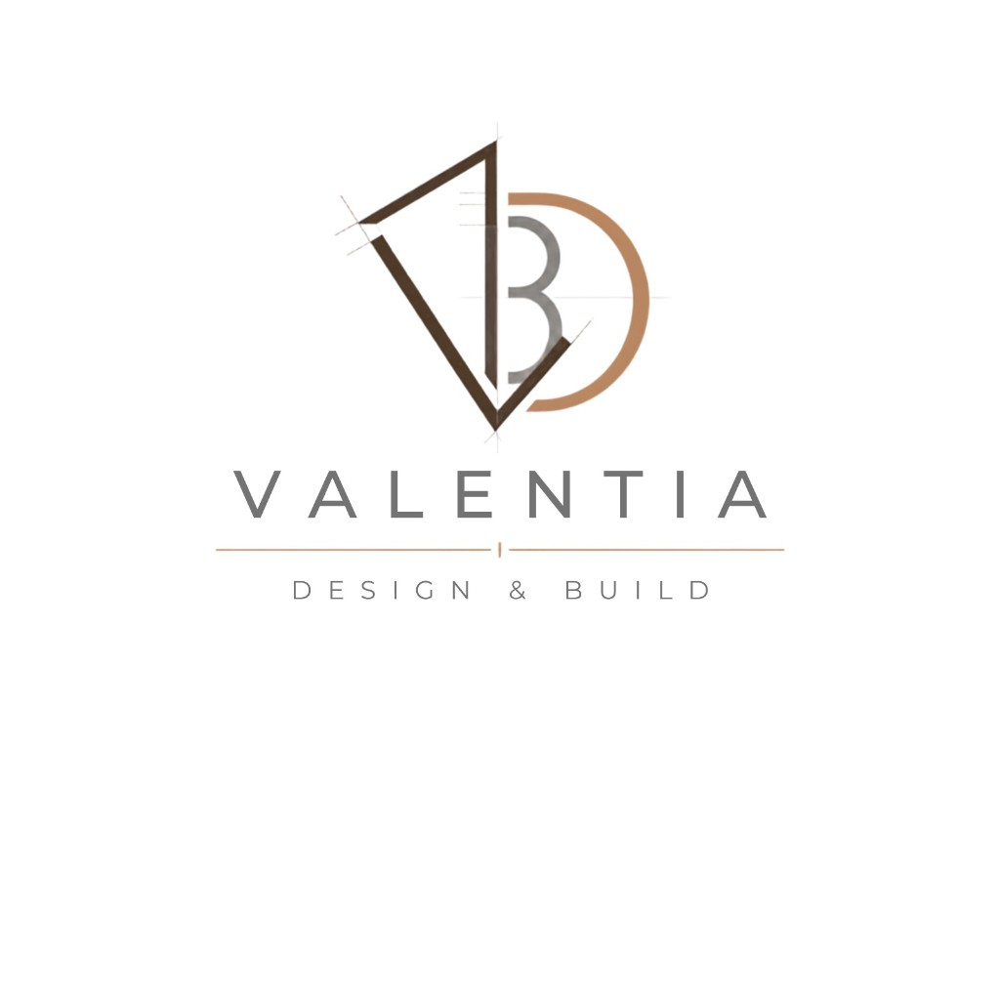

<p align="center">
  
</p>

<h1 align="center">Valentia</h1>

<p align="center"><strong>Design &amp; Build</strong></p>

<p align="center">
  Interior design &amp; fit-out platform — from project request to handover.<br/>
  Customers, engineers, managers, owners, and admins in one workflow.
</p>

<p align="center">
  
  
  
  
  
  
</p>

---

## Monorepo

| Path | Role | Dev |
|------|------|-----|
| [`client/`](./client/) | Customer web app | `npm run dev` → :3000 |
| [`dashboard/`](./dashboard/) | Admin / ops web app | `npm run dev` → :3001 |
| [`server/`](./server/) | NestJS API + Prisma + Redis | `npm run start:dev` → :5000 |

> Repo directory name is `fitout/`; product brand is **Valentia**.

## Quick start (API)

```bash
cd server
cp .env.example .env   # if needed
npm install
npm run docker:up
npm run prisma:generate
npm run start:dev
```

- API: http://localhost:5000/api  
- Health: http://localhost:5000/api/health  
- Swagger: http://localhost:5000/docs  

## Documentation

| Doc | Description |
|-----|-------------|
| [`valentia-business.md`](./valentia-business.md) | Business model for agents (from BRD) |
| [`Business Requirements Document (BRD).md`](./Business%20Requirements%20Document%20(BRD).md) | Full BRD |
| [`design.md`](./design.md) | Brand identity & design system |
| [`AGENTS.md`](./AGENTS.md) | Agent / contributor guide |
| [`releases/README.md`](./releases/README.md) | Change audit index |

## Brand

Logo and color tokens live under [`assets/brand/`](./assets/brand/) and [`design.md`](./design.md) (espresso `#503C2C`, copper `#B88460`, slate `#707070`).

## License

UNLICENSED / private — unless otherwise stated by the owners.
